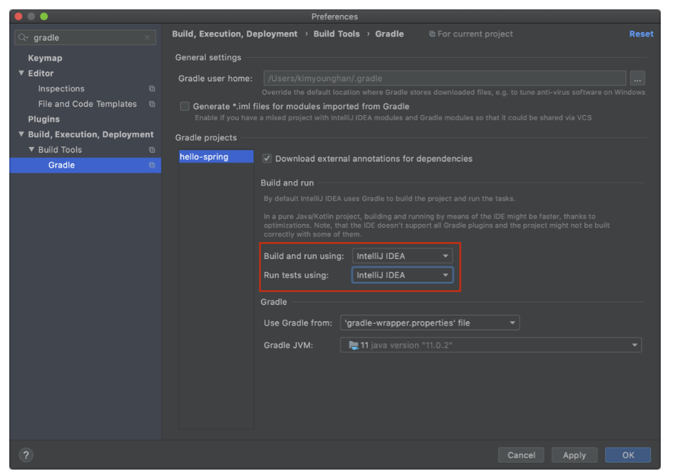

## IntelliJ 학습

### IntelliJ Gradle 대신에 자바 직접 실행
- 최근 IntelliJ 버전은 Gradle을 통해서 실행 하는 것이 기본 설정이다. 이렇게 하면 실행속도가 느리다.
다음과 같이 변경하면 자바로 바로 실행해서 실행속도가 더 빠르다.

- Preferences 
  - Build, Execution, Deployment 
    - Build Tools 
      - Gradle 
        - Build and run using: Gradle IntelliJ IDEA
        - Run tests using: Gradle IntelliJ IDEA

### 단축기(macOS)
- Cmd + Shift + Enter : 문자 자동 완성
- Shift + F6 : 변수 이름 변경
- Cmd + Option + v : 변수 추출하기
- Cmd + Shift + T : 해당 클래스에 대한 테스트 케이스 생성
- control + enter : Code/Generate